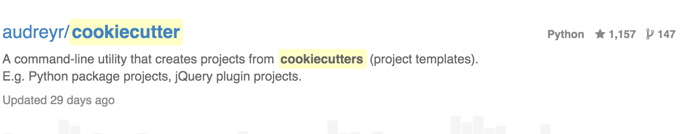

section: intro
slides: 10
background-image: url(resources/sesame-street-cookie-monster-wallpapers_35947_1680x1050.jpg)
class: inverse, center

# cookiemonster

http://michaeljoseph.github.io/cookiemonster

@michaeljoseph

???
**0.0**

This talk is about 3 things:

cookiecutter

open source and other distributed software development methodologies

engaging with a technical community

---
background-image: url(resources/puppet-blue-awesome.jpg)

# cookiemonster
### the evolution of open source software development community contribution
---
background-image: url(resources/google-cookie_00405143.jpg)
class: inverse, center

## User to Complainer to Helper to Core: the evolution of open source software development communities
???

---
class: inverse
title: about-me
# about me


???
**0.1**

I have, as usual, prepared this talk on very short notice
So, be prepared for my slides to be unpolished.
I shall attempt to make up for it with the words and exaggerated body language

I'm, I guess what you'd call a backend developer.

I self-identify as a Python developer, but I've written production code in
a lot of languages. Python is just the best :heart:

---
class: center, inverse
# polyglot

VB

Java

PHP

C#

Python

Ruby (shush)
???
**0.2**

The more language you see, the less appetite you have for religious wars.
DevError: Only using tools written in languages that you like is not necessary.
Sometimes you can just be the user of a piece of software. Programmers make

---
# i  CLIs
???
**0.3**

Many times, as I'm in the middle of telling someone about this amazing new cli 
tool I discovered...

---
background-image: url(resources/butterfly.gif)
???
**0.3.1**

butterfly web term, so you never have to leave your browser

---
background-image: url(resources/rainbowstream.gif)
???
**0.3.2**

rainbowstream, a twitter client

---
background-image: url(resources/jrnl.png)
???
**0.3.3**

jrnl- a note taker.
And then they ask me what language it's written in and wrinkle their noses
in faint disgust at the horror of running a program in an unattractive language.

---
background-image: url(resources/youtube-dl.png)
background-size: 100%
???
**0.3.5**

Youtube Downloader

---
# lightning talk
## How I Learned To Stop Worrying And Love The CLI
???
**0.3.6**

Good CLIs slip down into the fabric of the interface.
Does anyone care what language diff or ack are written in, as long as they work?
I'm going to resist the urge to spin this off into a lightning talk

---
section: cookiecutter


???
**1.0**

Ok, 10 slides in, let's start this talk!

Cookiecutter is a CLI that lets you template your projects.

- project generation tool

- creates the files and directories setup just right to start a new project.

- Jinja templated so that you can customise the template.

- the CLI processes a template repo and prompts you for value to search replace

---


slloccount
coverage text
cross platform
scope consious

???
**1.1**

Medium sized, sort of teenaged open source project

---
# why i  cookiecutter as a programming user
???
**1.2**

As a programming user, I create new projects.

I cringed everytime I `cp -R ../` from one of my example implementations

You want to be able to easily generate a new thing and feed improvements back into
the template.

As a member of the development team, I want there to be once place for me
to make improvements to the structure and conventions of our applications.

---
class: center, inverse
# why i  cookiecutter as a programmer

Python

Command line i/o

File i/o

APIs

Modules

???
**1.3**

It's written in Python

It's made up of the bread and butter backend programming of my youth.

---
# why i  cookiecutter as a programmer

well documented (http://changes.rtfd.org)

well tested 

cool community (users, deveopers, core, BFDL)

scratches my itch

???
**1.4**
Silence

---
# use case: microservice archictures

libraries
services
ui components

???
**1.5**

Useful at your dayjob.

The latest koolaid has you quickly reaching the point of repeating yourself very quickly,
and the faster and frictionlessly (aka smoothly) you can start a new project, or crank
out a release, the better.

---
# use case: web app installations

???
**1.6**

per-client instances of an application

---
section: changes
background-image: url(resources/changes.png)

???
**2.0**

Origin Story or the itch I wanted to scratch.

---
# from cookiecutter import generate

???
**2.1**

In order to `start`, I _need_ to programatically generate a cookiecutter template (optimised for changes opinions about python packages).

> I have a dream, where the distance from thought to indexable
> resource, is only a naturally crafter cli command away

---
## changes::start

???
**2.2**

cookiecutter

hub init

changes flow
---
## changes:flow

git flow for packages

???
**2.3**

Example usage: TODO (slide per thing)

---
section: team open source


???
**3.0**

back to the story
usage, issue search => triage

---
# Triage

???
**3.1**

Triage

---
# Review

???
**3.2**

!!!Git diff advertising company; comment advertising!!!

Similar features, code reviews

Review and encourage

Re-review, defend yourself politely

---
# Code

???
**3.3**

Small, focused pull requests

---
# AUTHORS.md

```python
print('@michaeljoseph' in open(AUTHORS.md).read())
```

???
**3.4**

My bugs are on your computer....

---
# commit bit

???
**3.5**

Largely on the back of extra context triage, I get the bit.
Now to wield it with great responsibility.

---
section: extra context
# extra context overview

???
**4.0**

So, let's take quick walk through the actual feature
and the story of it's development and review.

---
???
**4.1**

api + cli (context overrides)

cookiecutter.json (template defaults)

user context (cookiecutter rc)

**project context** (overrides)

---
# extra context PR tour
https://github.com/audreyr/cookiecutter/pull/260

???
**4.2**

Cmd-click

---
# lessons

???
**4.3**

don't get carried away
small changes are gentler on reviewers (open source context is expensive)
documentation is a first class citizen
keep focused
merge wars over changes that touch lots of files

---
# result
## compromise, pragmatism and followup

cherry picking is as fun and easy as it sounds

???
**4.4**

Depends on sound commits

---
section: outro
# summary

???
**5.0**

Precis

---
align: center
# AMA


???
**5.1**
Repeat the questions while you think of the answer.

---
# links

http://cookiecutter.rtfd.org

https://github.com/audreyr/cookiecutter

http://michaeljoseph.github.io/cookiemonster

???
**5.2**

**The End**
---
background-image: url(resources/cookie-monster-28559-1440x900.jpg)
